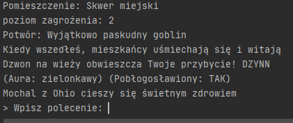
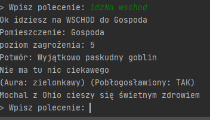
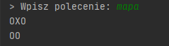
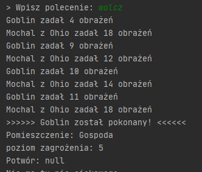
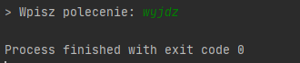

# NyetHack---Big-Nerd-Ranch-book  
NyetHack is a text game created while learing 
Kotlin with Programming in Kotlin book from Big Nerd Ranch

## Table of contents
[Code Explanation](#code)  
[Run the game!](#game)  

## Code Explanation <a name="code"></a>  

### Player class  
Player class provides us with all features that our Hero should have.  
For example print status method:
```kotlin
fun formatHealthStatus(): String {
        val healthStatus = when (healthPoints) {
            100 -> "cieszy się świetnym zdrowiem"
            in 90..99 -> "ma kilka draśnięć"
            in 75..89 -> if (isBlessed)
                "odniósł kilka pomniejszych ran, ale szybko dochodzi do zdrowia" else "odniósł kilka pomniejszych ran"
            in 15..75 -> "Jest poważnie ranny"
            else -> "Jest w opłakanym stanie"
        }
        return healthStatus
    }
```

### Room  
This class contains every room parameter.
```kotlin
package com.bignerdranch.nyerhack

open class Room(val name: String) {
    protected open val dangerLevel = 5
    open fun load() = "Nie ma tu nic ciekawego"
    var monster: Monster? = Goblin()
    fun description() = "Pomieszczenie: $name \npoziom zagrożenia: $dangerLevel \nPotwór: ${monster?.description}"
}
```

### Monster and Goblin
Abstract class monster and class Goblin that extends Monster

```kotlin
abstract class Monster(
    val name: String,
    val description: String,
    override var healthPoints: Int)
    :Fightable{

    //Fightable fun
    override fun attack(opponent: com.bignerdranch.nyerhack.Fightable): kotlin.Int {
        val damageDealt = damageRoll
        opponent.healthPoints -= damageDealt
        return damageDealt
    }
}

```
### Fightable interface  
This interface provides battles in our world
```kotlin
package com.bignerdranch.nyerhack

import java.util.*

interface Fightable {
    var healthPoints: Int
    val diceCount: Int
    val diceSides: Int
    val damageRoll: Int
        get() = (0 until diceCount).map {
            Random().nextInt(diceSides + 1)
        }.sum()

    fun attack(opponent: Fightable): Int
}

```


### Game and main loop  
Game provides command handling, prints player and room status and has main loop
Game loop:
```kotlin
fun play() {
        while (run){
            //Pokój
            println(currentRoom.description())
            println(currentRoom.load())
            //stan zdoriwa gracza
            printPlayerStatus(player)
            print("> Wpisz polecenie: ")
            GameInput(readLine()).processCommand()
            Thread.sleep(300)
        }
    }
```

## Run the game! <a name="game"></a>  
1.run  

 
2.idzNa  


3.mapa  


4.walcz  
  

5.wyjdz  
 
